# BookedIn

## Description
BookedIn – A Book Reservation System built with PHP for logic, CSS for style, and MySQL as the database.

## Features
- View all books
- Search for books
- Registration
- Login/Logout
- View user profile
- Edit/remove user data
- Reserve books
- View/remove reserved books

## Installation
## 1. Clone this repository (`booked-in-web`)
```bash
git clone https://github.com/lokChingt/booked-in-web.git
```

## 2. Create database and tables for `Users`, `Categories`, `Books` and `Reservations`
- Run SQL script `database/booked-in_db.sql`

## 3. Run live server
- Enter `http://localhost/booked-in-web/pages/index.php` (Home page) for url

## Screenshots
### Home Page (index.php)
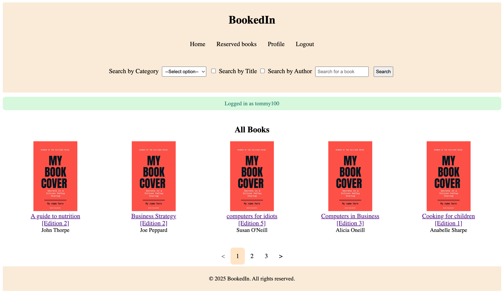

### Book Info Page (book_info.php)
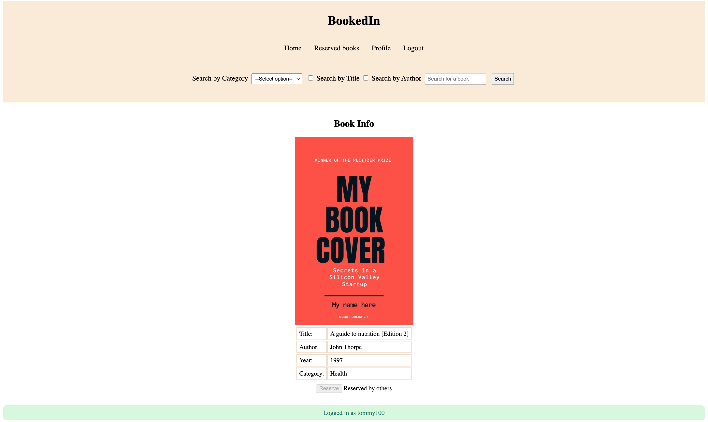

### Search Page (search.php)
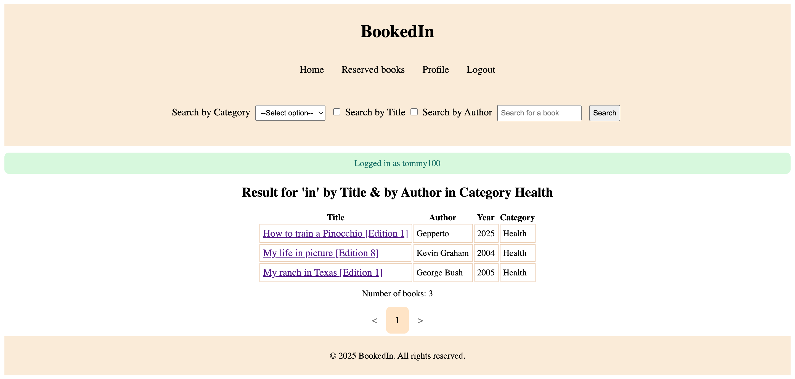

### Register Page (register.php)
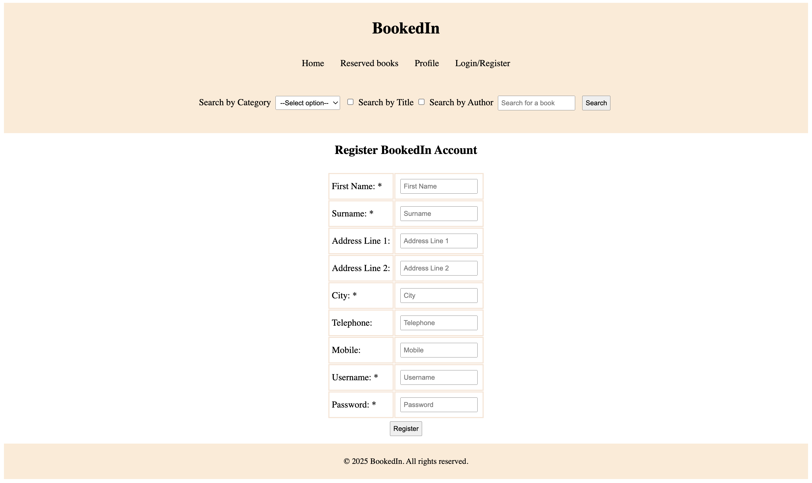

### Login Page (login.php)
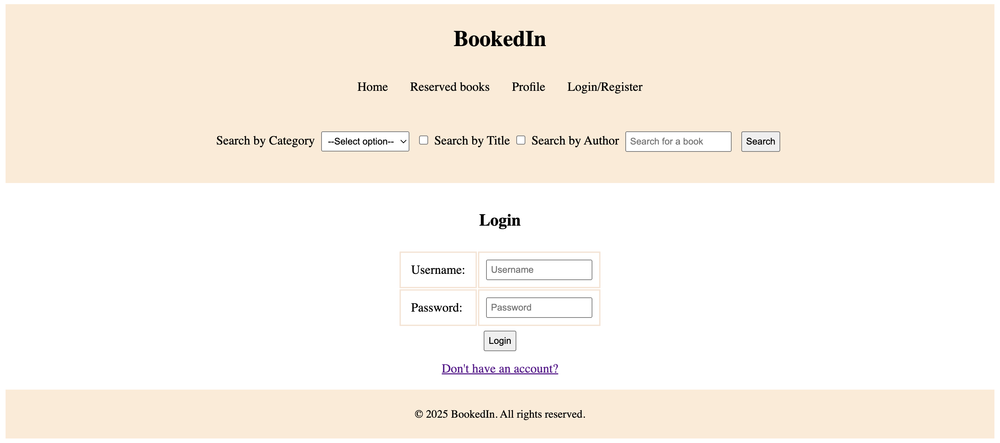

### Profile Page (profile.php)
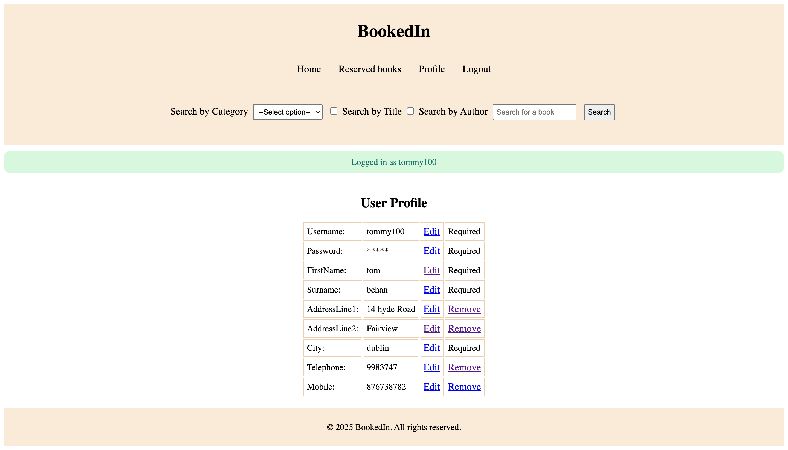

### Edit User Data Page (edit_data.php)
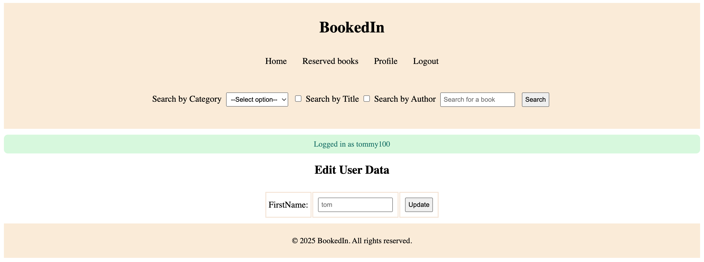

### View Reserved Books Page (view_reserved.php)
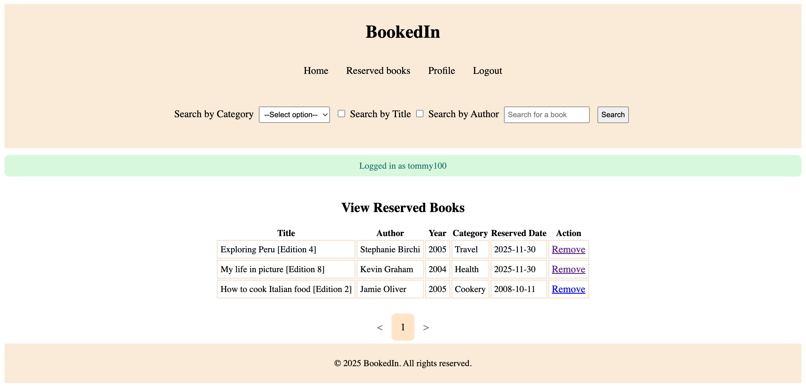

### Remove Reserved Page (remove_reserved.php)
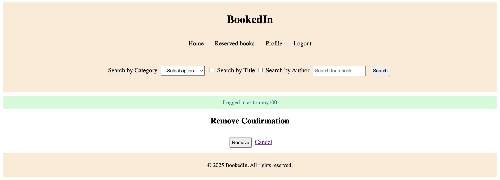

### Flowchart
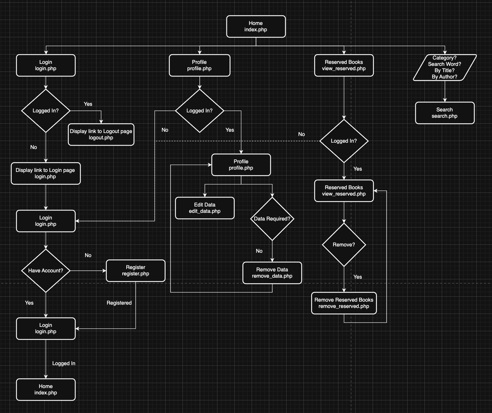

### ER Diagram
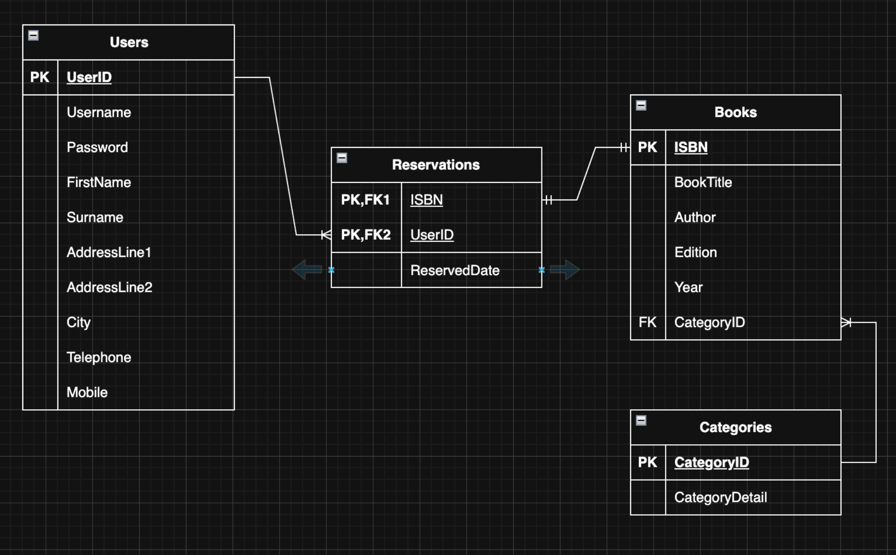

## Technologies Used
- PHP
- CSS
- MySQL